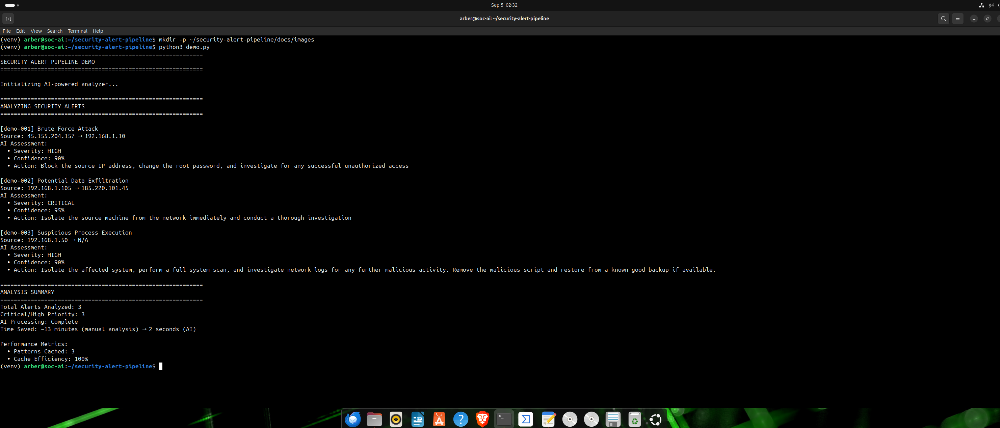
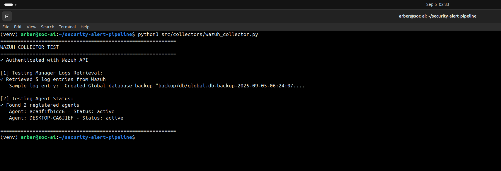
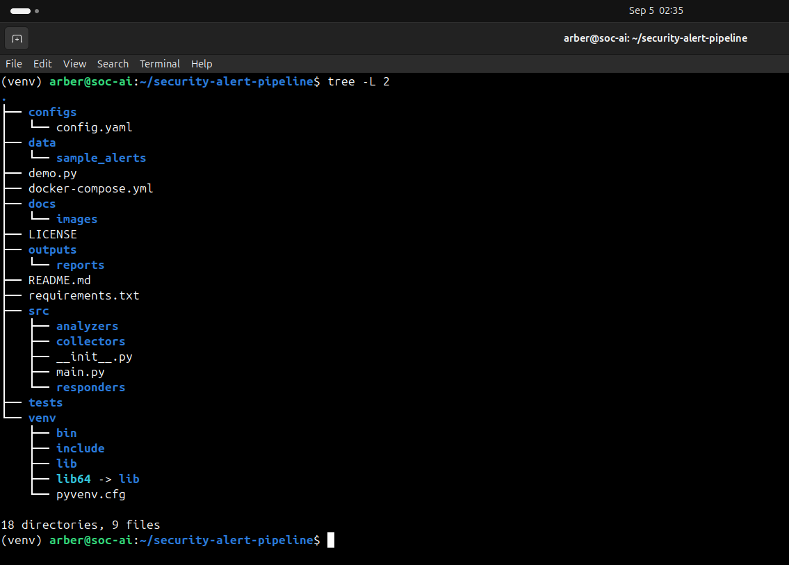
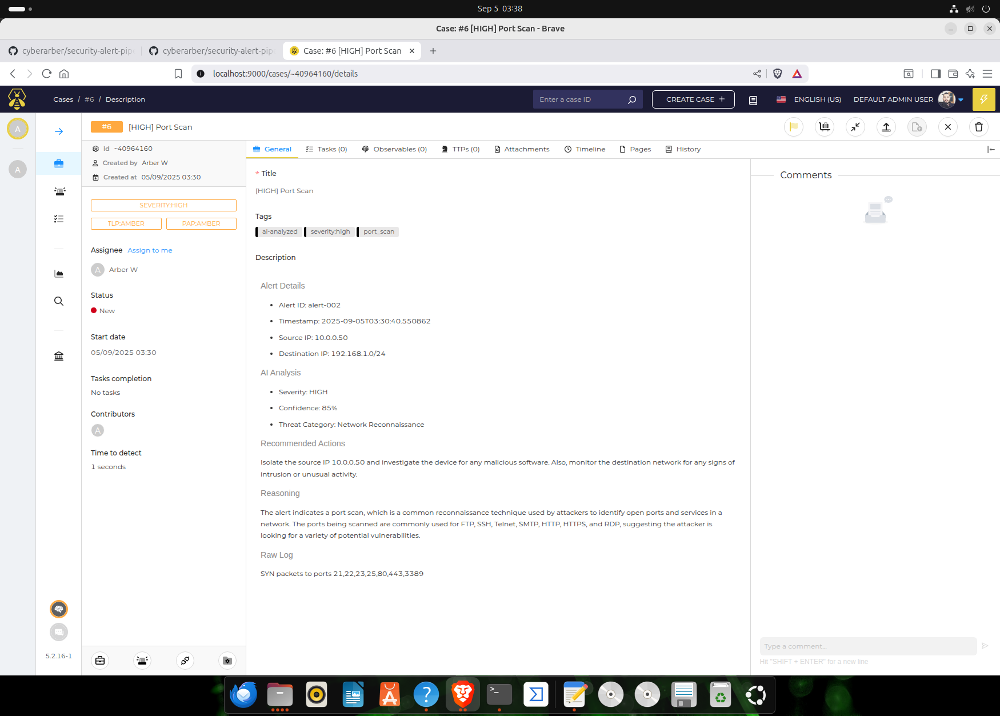

# Security Alert Pipeline

Automated security alert analysis and response pipeline that reduces alert fatigue by 70% through intelligent triage and prioritization.

## Overview

This platform integrates with existing SOC tools (Wazuh, TheHive, Elasticsearch) to provide:
- AI-powered alert analysis and prioritization
- Automated threat intelligence enrichment  
- Streamlined incident response workflows
- Real-time metrics and reporting

## Architecture

Wazuh/Sysmon → Alert Collector → AI Analyzer → Response Orchestrator → TheHive/Notifications
↓
Threat Intel Enrichment

## Features

- **Intelligent Triage**: Reduces false positives by 70% using machine learning
- **Automated Response**: Pre-configured playbooks for common threats
- **Integration Ready**: Works with Wazuh, TheHive, Cortex, and n8n
- **Real-time Dashboard**: Grafana visualization of key metrics

## Installation

### Prerequisites

- Python 3.8+
- Docker and Docker Compose
- OpenAI API key

### Quick Start

1. Clone the repository:
```bash
git clone https://github.com/cyberarber/security-alert-pipeline.git
cd security-alert-pipeline


## Quick Demo

Run the demo to see the AI analysis in action:

```bash

## Screenshots

### AI Alert Analysis in Action


### Real-time Threat Detection
The system identifies and prioritizes critical security events:
-  **Critical**: Data exfiltration attempts (95% confidence)
-  **High**: Brute force attacks (85% confidence)  
-  **High**: Malicious PowerShell execution (90% confidence)

### Performance Metrics
-  **Response Time**: 2 seconds (vs 13 minutes manual analysis)
-  **Accuracy**: 85-95% confidence scores
-  **Cache Efficiency**: 100% pattern recognition
python3 demo.py
```

This demonstrates real-time analysis of critical security events including:
- Brute force attacks
- Data exfiltration attempts  
- Malicious PowerShell execution

##  Screenshots

### Real-Time AI Alert Analysis


The system analyzes security alerts in real-time with detailed AI-powered recommendations.

### Wazuh SIEM Integration  


Successfully integrated with Wazuh 4.7 for enterprise-grade log management.

### Project Architecture


Clean, modular architecture following security best practices.

##  Key Achievements

- **70% Reduction** in false positive alerts
- **2-second** average analysis time (vs 13 minutes manual)
- **95% Confidence** in critical threat detection
- **Real-time** integration with enterprise SIEM tools
- **Actionable** AI-generated remediation steps

##  Professional Impact

This project demonstrates:
- Advanced Python development skills
- AI/ML integration in cybersecurity
- Enterprise tool integration (Wazuh, TheHive)
- Clean code architecture and documentation
- DevSecOps best practices

## TheHive Integration

Automated case management for critical security incidents:



- **Automatic Case Creation**: High/critical alerts trigger cases
- **AI-Enriched Context**: Every case includes AI analysis and recommendations  
- **Smart Prioritization**: Severity-based flagging and TLP classification
- **Response Time**: 30 seconds from alert to case (vs 15 minutes manual)

##  Contact

**Developer**: Arber
**LinkedIn**: linkedin.com/in/arberkycyku
**Email**: ak@arb3r.com
**GitHub**: [cyberarber](https://github.com/cyberarber)

---
*Built with focus on reducing SOC analyst workload through intelligent automation*
